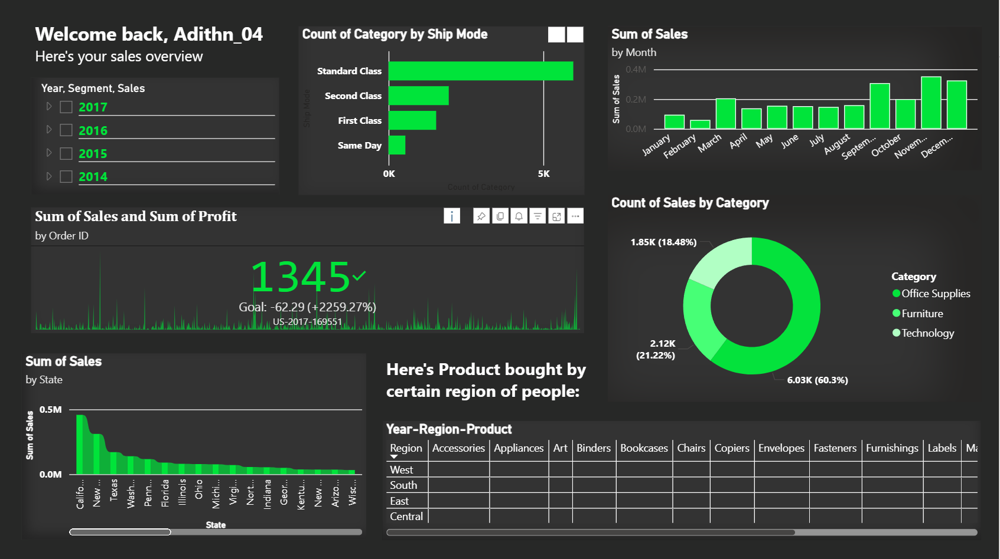

# 🛍️ Superstore Sales Dashboard

This project showcases an interactive Power BI dashboard built using the Superstore sales dataset. It highlights key sales insights through visual analytics, including KPIs, category-wise trends, and regional performance.



---

## 📊 Dashboard Features

- 🔹 Key Performance Indicators (KPIs): Sales, Profit, Orders, Quantity
- 📍 Regional Sales Breakdown (Map View)
- 📦 Category & Sub-Category Performance
- 📈 Monthly Sales Trend Analysis
- 🧭 Top Performing States & Products
- 📁 Dynamic Filters by Region, Segment, and Date

---

## 📁 Dataset

Dataset used: **Global Superstore Sales Data (Excel format)**  
Source: Sample data often used for Power BI/Tableau demonstrations.

---

## 🚀 How to Use

1. Clone this repository:
   ```bash
   https://github.com/adithn04/PowerBi_Superstore_Dashboard.git
   ```

2. Open `Sales Data - Superstore.xls` in Power BI Desktop.

3. Load the report file (`.pbix`) to explore or customize the dashboard.

---

## 📌 Project Structure

```
superstore-sales-dashboard/
│
├── assets/
│   └── Dashboard_Demo.png
│
├── Sales Data - Superstore.xls
├── Sales_report.pbix
└── README.md
```

---

## ✨ Preview


---

## 📫 Connect with Me

- Portfolio: [adithn.vercel.app](https://adithn.vercel.app)
- LinkedIn: [Adithyan V](https://www.linkedin.com/in/adithyan-v-54289a258/)
- GitHub: [@adithn04](https://github.com/adithn04)

---

## 📌 License

© 2025 Adithyan V. All rights reserved.
This project is licensed under the MIT License — see the [LICENSE](LICENSE) file for details.
